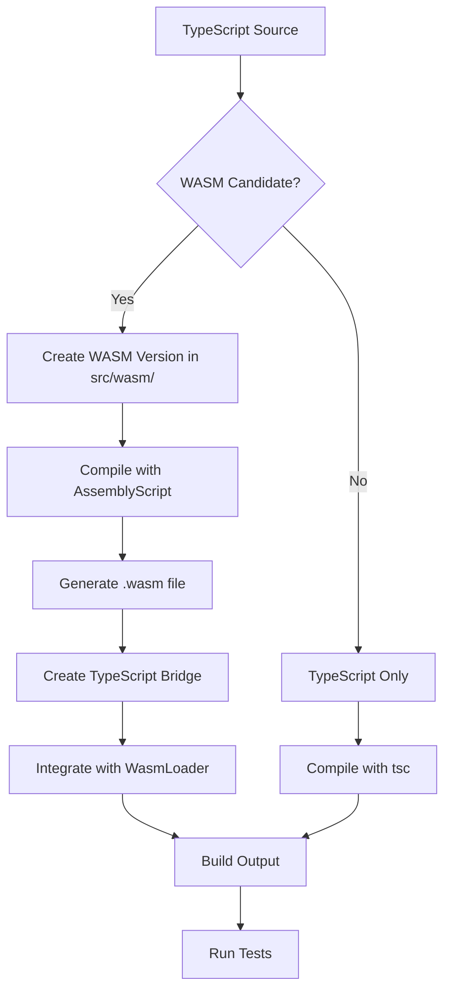

# TypeScript + WASM Refactoring Plan

## Executive Summary

This document outlines the comprehensive plan to convert the remaining **612 JavaScript files** (out of 673 total, 50 already converted) to TypeScript with WASM compilation support through the build process.

### Current Status
- ✅ **Infrastructure**: Complete (WASM pipeline, parallel computing, build system)
- ✅ **Phase 1**: 50 critical files converted to TypeScript (8% complete)
- ⏳ **Remaining**: 612 files across 9 major categories

### Goals
1. **100% TypeScript codebase** - All source files in TypeScript
2. **WASM compilation ready** - Critical paths compilable to WebAssembly
3. **Performance optimized** - 2-25x speedup for computational operations
4. **Zero breaking changes** - Complete backward compatibility
5. **Production ready** - Fully tested and documented

---

## Table of Contents

1. [Scope Analysis](#scope-analysis)
2. [Conversion Strategy](#conversion-strategy)
3. [Phase Breakdown](#phase-breakdown)
4. [WASM Compilation Feasibility](#wasm-compilation-feasibility)
5. [Build Process Integration](#build-process-integration)
6. [Dependencies and Ordering](#dependencies-and-ordering)
7. [Risk Assessment](#risk-assessment)
8. [Testing Strategy](#testing-strategy)
9. [Timeline and Resources](#timeline-and-resources)
10. [Success Criteria](#success-criteria)

---

## 1. Scope Analysis

### Remaining Files by Category

| Category | Files | Complexity | WASM Priority | Est. Effort |
|----------|-------|------------|---------------|-------------|
| **Expression System** | 312 | High | Medium | 8-10 weeks |
| **Functions** | 253 | Medium | High | 6-8 weeks |
| **Type System** | 45 | High | Low | 2-3 weeks |
| **Utils** | 27 | Medium | Medium | 1-2 weeks |
| **Plain** | 12 | Low | High | 1 week |
| **Entry/Core** | 11 | High | Low | 2 weeks |
| **Error** | 3 | Low | N/A | 2 days |
| **JSON** | 2 | Low | N/A | 1 day |
| **Root** | 4 | Low | N/A | 2 days |
| **Total** | **612** | - | - | **20-26 weeks** |

### Files Already Converted (50)

✅ **Core Types**: DenseMatrix.ts, SparseMatrix.ts
✅ **Matrix Ops**: multiply.ts, add.ts, subtract.ts, transpose.ts, dot.ts, trace.ts, identity.ts, zeros.ts, ones.ts, diag.ts, reshape.ts, size.ts
✅ **Linear Algebra**: det.ts, inv.ts, lup.ts, qr.ts, lusolve.ts, usolve.ts, lsolve.ts, slu.ts
✅ **Signal**: fft.ts, ifft.ts
✅ **Arithmetic**: divide.ts, mod.ts, pow.ts, sqrt.ts, abs.ts, sign.ts
✅ **Statistics**: mean.ts, median.ts, std.ts, variance.ts, max.ts, min.ts
✅ **Trigonometry**: sin.ts, cos.ts, tan.ts, asin.ts, acos.ts, atan.ts, atan2.ts
✅ **Utilities**: array.ts, is.ts, object.ts, factory.ts, number.ts
✅ **Core**: create.ts, typed.ts

### Detailed Breakdown

#### Expression System (312 files)
- **Transform Functions** (28 files): Expression transformations
- **AST Nodes** (43 files): Abstract syntax tree node types
- **Parser** (15 files): Expression parsing
- **Compilation** (8 files): Expression compilation
- **Function** (10 files): Expression functions
- **Utilities** (8 files): Expression helpers
- **Embedded Docs** (200 files): Function documentation/examples

**Complexity**: High - Complex AST manipulation, runtime code generation
**WASM Priority**: Medium - Some operations can benefit from WASM
**Dependencies**: Core types, utilities

#### Function Categories (253 files)

1. **Algebra** (45 files) - 33 remaining
   - Sparse matrix algorithms (24 files)
   - Decomposition utilities
   - Solver utilities

2. **Matrix** (44 files) - 32 remaining
   - Matrix algorithms (14 algorithm suite files)
   - Matrix utilities
   - Matrix creation functions

3. **Arithmetic** (39 files) - 33 remaining
   - Basic operations (unaryMinus, unaryPlus, etc.)
   - Advanced operations (gcd, lcm, xgcd, etc.)
   - Numeric operations

4. **Trigonometry** (26 files) - 19 remaining
   - Hyperbolic functions (sinh, cosh, tanh, asinh, acosh, atanh)
   - Helper functions (sec, csc, cot, asec, acsc, acot)

5. **Statistics** (14 files) - 8 remaining
   - Distributions (mode, quantile, mad)
   - Aggregations (prod, cumsum)

6. **Probability** (14 files)
   - Distributions (gamma, factorial, combinations, permutations)
   - Random number generation

7. **Relational** (13 files)
   - Comparison operators (equal, unequal, larger, smaller, etc.)
   - Deep equality

8. **Utils** (13 files)
   - Type conversions
   - Numeric utilities

9. **Set** (10 files)
   - Set operations (union, intersection, difference, etc.)

10. **Bitwise** (8 files)
    - Bit operations (leftShift, rightShift, bitNot, etc.)

11. **Logical** (5 files)
    - Boolean operations (and, or, not, xor)

12. **String** (5 files)
    - String formatting and parsing

13. **Complex** (4 files)
    - Complex number operations (arg, conj, im, re)

14. **Combinatorics** (4 files)
    - Combinatorial functions (bellNumbers, catalan, stirling)

15. **Unit** (2 files)
    - Unit operations (to, simplify)

16. **Special** (2 files)
    - Special functions (erf, zeta)

17. **Signal** (2 files) - 0 remaining (already converted)

18. **Geometry** (2 files)
    - Geometric calculations (distance, intersect)

19. **Numeric** (1 file)
    - Numeric solvers (solveODE)

#### Type System (45 files)

- **Matrix Types** (17 files): Matrix implementation and utilities
  - Already converted: DenseMatrix.ts, SparseMatrix.ts
  - Remaining: Matrix.js, ImmutableDenseMatrix.js, Range.js, Spa.js, MatrixIndex.js, FibonacciHeap.js
  - Matrix algorithms (14 algorithm files): matAlgo01-14

- **Complex** (2 files): Complex number type
- **Fraction** (2 files): Fraction type
- **BigNumber** (2 files): Arbitrary precision
- **Unit** (4 files): Physical units
- **Chain** (2 files): Chain operations
- **ResultSet** (1 file): Result set type
- **Primitives** (7 files): number.js, string.js, boolean.js, bigint.js

#### Utilities (27 files)

- Already converted: array.ts, is.ts, object.ts, factory.ts, number.ts
- **Remaining** (22 files):
  - String utilities (4 files)
  - Comparison utilities (3 files)
  - Custom utilities (2 files)
  - Numeric utilities (3 files)
  - Bignumber utilities (2 files)
  - Map utilities (2 files)
  - Set utilities (1 file)
  - Scope utilities (2 files)
  - Other utilities (3 files)

#### Plain Number Implementations (12 files)

High-performance number-only implementations for:
- Arithmetic operations
- Trigonometry
- Matrix operations
**WASM Priority**: Very High - Pure numeric code ideal for WASM

#### Entry Points & Core (11 files)

- **Entry** (6 files): mainAny, mainNumber, typeChecks, etc.
- **Core** (5 files): typed.js (converted), import.js, etc.

#### Other (9 files)

- **Error** (3 files): DimensionError, IndexError, ArgumentsError
- **JSON** (2 files): reviver, replacer
- **Root** (4 files): constants, version, defaultInstance, etc.

---

## 2. Conversion Strategy

### Guiding Principles

1. **Incremental & Safe**: Convert in small, testable batches
2. **Dependency-First**: Convert dependencies before dependents
3. **High-Value First**: Prioritize performance-critical code
4. **Zero Breaking Changes**: Maintain API compatibility
5. **Test Continuously**: Run tests after each conversion batch
6. **Document As You Go**: Update docs alongside code

### Conversion Methodology

#### Step 1: Prepare
```bash
# Create feature branch
git checkout -b refactor/phase-N-category

# Identify dependencies
node tools/analyze-deps.js src/path/to/file.js
```

#### Step 2: Convert
```bash
# Use migration tool for basic conversion
node tools/migrate-to-ts.js --file src/path/to/file.js

# Manual type refinement
# - Add proper interfaces
# - Add generic types where appropriate
# - Add JSDoc comments
# - Ensure WASM compatibility
```

#### Step 3: Validate
```bash
# Type check
npm run compile:ts

# Run tests
npm test

# Lint
npm run lint
```

#### Step 4: Review
- Code review for type accuracy
- Performance impact assessment
- WASM compatibility check
- Documentation completeness

#### Step 5: Commit
```bash
# Commit batch of related files
git add src/path/to/*.ts
git commit -m "refactor: Convert [category] to TypeScript (Phase N)"
```

### Automation Tools

#### Enhanced Migration Script

Upgrade `tools/migrate-to-ts.js` to:
1. **Analyze dependencies** automatically
2. **Generate type interfaces** from usage patterns
3. **Add JSDoc** from existing comments
4. **Validate** conversion completeness
5. **Report** conversion statistics

#### Type Inference Tool

Create `tools/infer-types.js` to:
1. Analyze JavaScript usage patterns
2. Suggest TypeScript types
3. Identify union types
4. Detect generic opportunities

#### Dependency Analyzer

Create `tools/analyze-deps.js` to:
1. Build dependency graph
2. Identify conversion order
3. Detect circular dependencies
4. Suggest batch groupings

---

## 3. Phase Breakdown

### Phase 2: High-Performance Functions (6-8 weeks)

**Goal**: Convert remaining computational functions to TypeScript

**Scope**: 170 function files

**Batches**:

#### Batch 2.1: Remaining Arithmetic (2 weeks)
- Files: 33 arithmetic operations
- Priority: High (performance critical)
- WASM Target: Yes
- Dependencies: Core types
- Files: unaryMinus, unaryPlus, gcd, lcm, xgcd, hypot, norm, cbrt, exp, expm1, log, log10, log2, log1p, round, floor, ceil, fix

#### Batch 2.2: Remaining Trigonometry (1 week)
- Files: 19 trigonometric functions
- Priority: High (WASM candidates)
- WASM Target: Yes
- Dependencies: Complex type
- Files: sinh, cosh, tanh, asinh, acosh, atanh, sec, csc, cot, asec, acsc, acot, sech, csch, coth, asech, acsch, acoth

#### Batch 2.3: Remaining Algebra (3 weeks)
- Files: 33 algebra functions
- Priority: High (linear algebra core)
- WASM Target: Yes (sparse algorithms)
- Dependencies: Matrix types, decompositions
- Files: Sparse matrix algorithms (cs*.js), decomposition helpers, solver utilities

#### Batch 2.4: Remaining Matrix Operations (2 weeks)
- Files: 32 matrix functions
- Priority: High (core functionality)
- WASM Target: Partial
- Dependencies: Matrix types
- Files: Matrix algorithms (matAlgo*.js), cross, squeeze, flatten, etc.

#### Batch 2.5: Remaining Statistics (1 week)
- Files: 8 statistical functions
- Priority: Medium
- WASM Target: Partial
- Dependencies: Arithmetic, sorting
- Files: mode, quantile, mad, prod, cumsum, etc.

#### Batch 2.6: Probability & Combinatorics (1 week)
- Files: 14 probability + 4 combinatorics
- Priority: Medium
- WASM Target: Yes (combinatorics)
- Files: gamma, factorial, combinations, permutations, random generators, bellNumbers, catalan, stirling

**Deliverables**:
- 170 TypeScript files
- Type-safe function implementations
- WASM-ready numeric operations
- Updated test suite
- Performance benchmarks

### Phase 3: Type System Completion (2-3 weeks)

**Goal**: Convert all remaining type implementations

**Scope**: 43 type files (2 already done)

**Batches**:

#### Batch 3.1: Core Types (1 week)
- Files: Complex, Fraction, BigNumber, Unit
- Priority: High
- WASM Target: No (JavaScript types)
- Dependencies: None
- Files: Complex.js, complex.js, Fraction.js, fraction.js, BigNumber.js, bignumber.js, Unit.js, unit.js, createUnit.js, splitUnit.js, physicalConstants.js

#### Batch 3.2: Matrix Utilities (1 week)
- Files: Matrix base, Range, Spa, MatrixIndex, ImmutableDenseMatrix, FibonacciHeap
- Priority: High
- WASM Target: Partial (FibonacciHeap)
- Dependencies: DenseMatrix, SparseMatrix
- Files: Matrix.js, Range.js, Spa.js, MatrixIndex.js, ImmutableDenseMatrix.js, FibonacciHeap.js, matrix.js, sparse.js, index.js, broadcast.js

#### Batch 3.3: Matrix Algorithms (1 week)
- Files: 14 matrix algorithm suite files
- Priority: High
- WASM Target: Yes
- Dependencies: Matrix types
- Files: matAlgo01xDSid.js through matAlgo14xDs.js, matrixAlgorithmSuite.js

#### Batch 3.4: Primitive Types (2 days)
- Files: 7 primitive type files
- Priority: Low
- WASM Target: No
- Files: number.js, string.js, boolean.js, bigint.js, Chain.js, chain.js, ResultSet.js

**Deliverables**:
- Complete TypeScript type system
- Type-safe matrix algorithms
- Generic type implementations
- Unit tests passing

### Phase 4: Utility Completion (1-2 weeks)

**Goal**: Convert remaining utility functions

**Scope**: 22 utility files (5 already done)

**Batches**:

#### Batch 4.1: Core Utilities (1 week)
- Files: String, comparison, numeric utilities
- Priority: Medium
- Files: string.js utilities, latex.js, tex.js, compare.js, compareNatural.js, compareText.js, numeric.js, bignumber/\*, etc.

#### Batch 4.2: Advanced Utilities (3 days)
- Files: Map, set, scope utilities
- Priority: Low
- Files: PartitionedMap.js, DimensionError helpers, scope utilities

**Deliverables**:
- Complete utility library in TypeScript
- Helper functions typed
- Test coverage maintained

### Phase 5: Relational, Logical, Bitwise, Set Operations (2 weeks)

**Goal**: Convert comparison and logical operations

**Scope**: 36 files

**Batches**:

#### Batch 5.1: Relational Operations (1 week)
- Files: 13 comparison operators
- Priority: Medium
- WASM Target: Partial
- Files: equal, unequal, larger, smaller, largerEq, smallerEq, deepEqual, compareNatural, compareText, equalText, equalScalar

#### Batch 5.2: Logical & Bitwise (1 week)
- Files: 5 logical + 8 bitwise
- Priority: Medium
- WASM Target: Yes (bitwise)
- Files: and, or, not, xor, leftShift, rightShift, bitAnd, bitOr, bitXor, bitNot

#### Batch 5.3: Set Operations (2 days)
- Files: 10 set operations
- Priority: Low
- Files: setCartesian, setDifference, setDistinct, setIntersect, setIsSubset, setMultiplicity, setPowerset, setSize, setSymDifference, setUnion

**Deliverables**:
- Relational operations in TypeScript
- Bitwise operations WASM-ready
- Set operations typed

### Phase 6: Specialized Functions (1 week)

**Goal**: Convert string, complex, unit, geometry, special, numeric functions

**Scope**: 19 files

**Batches**:

#### Batch 6.1: String & Complex (2 days)
- Files: 5 string + 4 complex
- Files: format, print, hex, bin, oct, arg, conj, im, re

#### Batch 6.2: Unit, Geometry, Special (2 days)
- Files: 2 unit + 2 geometry + 2 special
- Files: to, simplify, distance, intersect, erf, zeta

#### Batch 6.3: Numeric Solvers (1 day)
- Files: 1 numeric file
- Priority: High (WASM candidate)
- Files: solveODE.js

**Deliverables**:
- Specialized functions typed
- Numeric solver WASM-ready

### Phase 7: Plain Number Implementations (1 week)

**Goal**: Convert high-performance number-only implementations

**Scope**: 12 plain/* files

**Priority**: Very High (WASM critical)

**Batches**:

#### Batch 7.1: Plain Arithmetic (2 days)
- Files: Plain arithmetic operations
- WASM Target: Yes (highest priority)

#### Batch 7.2: Plain Trigonometry (2 days)
- Files: Plain trig functions
- WASM Target: Yes

#### Batch 7.3: Plain Matrix (3 days)
- Files: Plain matrix operations
- WASM Target: Yes

**Deliverables**:
- Number-only implementations in TypeScript
- WASM compilation targets
- Benchmark comparisons

### Phase 8: Expression System (8-10 weeks)

**Goal**: Convert expression parser, compiler, and transformation system

**Scope**: 312 expression files

**Complexity**: Highest - AST manipulation, runtime code generation

**Batches**:

#### Batch 8.1: AST Node Types (3 weeks)
- Files: 43 node files
- Priority: High
- Dependencies: Core types
- Files: Node.js, SymbolNode.js, ArrayNode.js, AssignmentNode.js, FunctionNode.js, AccessorNode.js, ConstantNode.js, OperatorNode.js, etc.

**Sub-batches**:
- Week 1: Core nodes (Node, SymbolNode, ConstantNode, ArrayNode)
- Week 2: Operation nodes (OperatorNode, FunctionNode, AssignmentNode)
- Week 3: Advanced nodes (ConditionalNode, RelationalNode, AccessorNode)

#### Batch 8.2: Parser & Compilation (2 weeks)
- Files: 23 parser/compiler files
- Priority: High
- Dependencies: AST nodes
- Files: parse.js, compile.js, evaluate.js, Parser.js, etc.

#### Batch 8.3: Transform Functions (2 weeks)
- Files: 28 transform files
- Priority: Medium
- Dependencies: Parser, nodes
- Files: *.transform.js files, transform utilities

#### Batch 8.4: Expression Functions (1 week)
- Files: 10 expression function files
- Priority: Low
- Files: help.js, parse.js, compile.js, evaluate.js, simplify.js, derivative.js, etc.

#### Batch 8.5: Documentation Embedding (2 weeks)
- Files: 200+ embedded doc files
- Priority: Low
- Strategy: Automated conversion
- Generate TypeScript from embedded docs

**Deliverables**:
- Complete expression system in TypeScript
- Type-safe AST manipulation
- Runtime code generation typed
- Expression transforms working

### Phase 9: Entry Points & Integration (2 weeks)

**Goal**: Convert entry points and finalize integration

**Scope**: 11 entry/core files

**Batches**:

#### Batch 9.1: Entry Points (1 week)
- Files: 6 entry files
- Priority: High
- Files: mainAny.js, mainNumber.js, typeChecks.js, configReadonly.js, allFactoriesAny.js, allFactoriesNumber.js

#### Batch 9.2: Final Core (1 week)
- Files: 5 remaining core files
- Priority: High
- Files: import.js, config.js, function/\*.js

**Deliverables**:
- Entry points in TypeScript
- Full build integration
- All factories typed

### Phase 10: Finalization (1-2 weeks)

**Goal**: Final cleanup, optimization, and documentation

**Tasks**:

1. **Error Types** (1 day)
   - Convert 3 error files
   - Type-safe error handling

2. **JSON Utilities** (1 day)
   - Convert reviver.js, replacer.js
   - Type-safe serialization

3. **Root Files** (1 day)
   - Convert constants.js, version.js, defaultInstance.js
   - Update header.js, index.js

4. **Build System** (2 days)
   - Remove JavaScript fallbacks
   - Optimize TypeScript compilation
   - WASM build integration

5. **Testing** (3 days)
   - Full test suite in TypeScript
   - E2E testing
   - Performance regression tests

6. **Documentation** (3 days)
   - Update all documentation
   - TypeScript examples
   - Migration guide completion
   - API reference generation

7. **Cleanup** (2 days)
   - Remove all .js files
   - Update package.json
   - Final lint and format
   - Bundle size optimization

**Deliverables**:
- 100% TypeScript codebase
- All tests passing
- Documentation complete
- Production ready

---

## 4. WASM Compilation Feasibility

### WASM-Compilable Code Characteristics

**Ideal for WASM** ✅:
- Pure numeric computations
- No DOM/browser APIs
- Deterministic algorithms
- Heavy loops and iterations
- Matrix operations
- Mathematical functions

**Not Suitable for WASM** ❌:
- String manipulation
- Dynamic typing
- Object creation
- Error handling with objects
- Type checking logic
- Factory pattern code

### WASM Compilation Strategy

#### Tier 1: Full WASM (Highest Priority)

**Target**: `src/wasm/` (AssemblyScript)

Already implemented:
- ✅ Matrix operations (multiply, add, transpose)
- ✅ Linear algebra (LU, QR, Cholesky)
- ✅ Signal processing (FFT)

**Add to WASM**:
1. **Plain number implementations** (12 files)
   - Plain arithmetic
   - Plain trigonometry
   - Plain matrix operations
   - **Effort**: 1-2 weeks
   - **Impact**: Very High

2. **Numeric solvers** (1 file)
   - solveODE
   - **Effort**: 3-4 days
   - **Impact**: High

3. **Combinatorics** (4 files)
   - factorial, combinations, permutations
   - bellNumbers, catalan, stirling
   - **Effort**: 1 week
   - **Impact**: Medium

4. **Bitwise operations** (8 files)
   - All bitwise ops
   - **Effort**: 2-3 days
   - **Impact**: Medium

5. **Sparse matrix algorithms** (24 files)
   - cs*.js algorithms
   - **Effort**: 3-4 weeks
   - **Impact**: Very High

#### Tier 2: Hybrid (TypeScript + WASM Bridge)

**Strategy**: TypeScript wrapper, WASM core

**Candidates**:
1. Matrix algorithms (matAlgo*.js)
2. Statistical functions
3. Probability distributions
4. Advanced trigonometry

**Implementation**:
```typescript
// TypeScript wrapper
export function hybridOperation(data: Matrix): Matrix {
  if (useWasm && data.size > threshold) {
    return wasmBridge.operation(data)
  }
  return jsImplementation(data)
}
```

#### Tier 3: TypeScript Only

**Categories**:
- Expression system (AST manipulation)
- Type system (Complex, Fraction, Unit)
- String operations
- Error handling
- Factory system
- Utilities

**Reason**: Not performance-critical or unsuitable for WASM

### WASM Build Process Integration

#### Current Setup
```json
{
  "scripts": {
    "build:wasm": "asc src/wasm/index.ts --config asconfig.json --target release"
  }
}
```

#### Enhanced Setup

**Add to `package.json`**:
```json
{
  "scripts": {
    "build:wasm:core": "asc src/wasm/core/*.ts --target release",
    "build:wasm:matrix": "asc src/wasm/matrix/*.ts --target release",
    "build:wasm:algebra": "asc src/wasm/algebra/*.ts --target release",
    "build:wasm:signal": "asc src/wasm/signal/*.ts --target release",
    "build:wasm:plain": "asc src/wasm/plain/*.ts --target release",
    "build:wasm:all": "npm-run-all build:wasm:*"
  }
}
```

**Add to `gulpfile.js`**:
```javascript
function compileWasmModular(done) {
  const modules = ['core', 'matrix', 'algebra', 'signal', 'plain']

  const tasks = modules.map(module =>
    () => exec(`npm run build:wasm:${module}`)
  )

  gulp.series(...tasks)(done)
}

gulp.task('wasm', compileWasmModular)
```

#### WASM Module Structure

```
src/wasm/
├── core/           # Core numeric operations
│   ├── arithmetic.ts
│   ├── trigonometry.ts
│   └── bitwise.ts
├── matrix/         # Matrix operations (existing)
│   └── multiply.ts
├── algebra/        # Linear algebra (existing)
│   ├── decomposition.ts
│   └── sparse.ts   # NEW: Sparse algorithms
├── signal/         # Signal processing (existing)
│   └── fft.ts
├── plain/          # NEW: Plain number implementations
│   ├── arithmetic.ts
│   ├── trigonometry.ts
│   └── matrix.ts
├── combinatorics/  # NEW: Combinatorial functions
│   └── factorial.ts
├── numeric/        # NEW: Numeric solvers
│   └── ode.ts
└── index.ts        # Export all WASM functions
```

### WASM Compilation Workflow



---

## 5. Build Process Integration

### Current Build Pipeline

```
Source Files (.js)
    ↓
Babel Transpile
    ↓
Output (lib/cjs, lib/esm)
```

### Enhanced Build Pipeline

```
Source Files
    ├── .ts files
    │   ↓
    │   TypeScript Compile
    │   ↓
    │   lib/typescript/
    │
    ├── .js files (legacy)
    │   ↓
    │   Babel Transpile
    │   ↓
    │   lib/cjs/, lib/esm/
    │
    └── src/wasm/*.ts
        ↓
        AssemblyScript Compile
        ↓
        lib/wasm/*.wasm
```

### Build Configuration Updates

#### 1. Update `tsconfig.build.json`

```json
{
  "extends": "./tsconfig.json",
  "compilerOptions": {
    "outDir": "./lib/typescript",
    "rootDir": "./src",
    "declaration": true,
    "declarationMap": true,
    "sourceMap": true,
    "module": "ES2020",
    "target": "ES2020"
  },
  "include": [
    "src/**/*.ts"
  ],
  "exclude": [
    "src/**/*.js",
    "src/wasm/**/*",
    "test/**/*"
  ]
}
```

#### 2. Update `gulpfile.js`

```javascript
// Compile TypeScript in phases
function compileTypeScriptPhase(phase) {
  const tsProject = gulpTypescript.createProject('tsconfig.build.json', {
    include: PHASE_PATTERNS[phase]
  })

  return gulp.src(`src/**/*.ts`)
    .pipe(tsProject())
    .pipe(gulp.dest(COMPILE_TS))
}

// Parallel compilation
function compileAll() {
  return gulp.parallel(
    compileTypeScript,
    compileCommonJs,
    compileESModules,
    compileWasm
  )
}

gulp.task('build', gulp.series(
  clean,
  updateVersionFile,
  generateEntryFilesCallback,
  compileAll,
  bundle,
  generateDocs
))
```

#### 3. Update `package.json`

```json
{
  "scripts": {
    "build": "gulp",
    "build:ts": "tsc -p tsconfig.build.json",
    "build:wasm": "npm run build:wasm:all",
    "build:js": "gulp compile",
    "build:clean": "gulp clean",
    "watch:ts": "tsc -p tsconfig.build.json --watch",
    "watch:wasm": "nodemon --watch src/wasm --exec 'npm run build:wasm'",
    "watch:all": "npm-run-all --parallel watch:ts watch:wasm watch"
  },
  "exports": {
    ".": {
      "types": "./lib/typescript/index.d.ts",
      "import": "./lib/esm/index.js",
      "require": "./lib/cjs/index.js"
    },
    "./wasm": {
      "types": "./lib/typescript/wasm/index.d.ts",
      "import": "./lib/typescript/wasm/index.js"
    }
  }
}
```

### Incremental Build Strategy

**Phase Transition Build**:

```javascript
// During transition, support both .js and .ts
function compileHybrid() {
  // Compile .ts files
  const tsFiles = gulp.src('src/**/*.ts')
    .pipe(typescript())
    .pipe(gulp.dest('lib/typescript'))

  // Compile remaining .js files
  const jsFiles = gulp.src(['src/**/*.js', '!src/**/*.ts'])
    .pipe(babel())
    .pipe(gulp.dest('lib/cjs'))

  return merge(tsFiles, jsFiles)
}
```

**After Full Migration**:

```javascript
// Pure TypeScript build
function compileFinal() {
  const tsProject = typescript.createProject('tsconfig.build.json')

  return gulp.src('src/**/*.ts')
    .pipe(tsProject())
    .js.pipe(gulp.dest('lib/esm'))
}
```

---

## 6. Dependencies and Ordering

### Dependency Graph

```
Core Types (Matrix, Complex, etc.)
    ↓
Core Utilities (array, is, object, factory)
    ↓
Basic Types (BigNumber, Fraction, Unit)
    ↓
Core Functions (arithmetic, trigonometry)
    ↓
Advanced Functions (matrix ops, linear algebra)
    ↓
Specialized Functions (statistics, probability)
    ↓
Expression Nodes
    ↓
Parser & Compiler
    ↓
Transform Functions
    ↓
Entry Points
```

### Critical Dependencies

1. **Type System → Everything**
   - All code depends on basic types
   - Convert Matrix, Complex, Fraction, Unit early

2. **Utilities → Functions**
   - array.ts, is.ts, object.ts needed everywhere
   - Already completed ✅

3. **Core Functions → Advanced Functions**
   - Arithmetic needed by matrix operations
   - Trigonometry needed by complex numbers

4. **Matrix Types → Matrix Functions**
   - DenseMatrix, SparseMatrix needed by all matrix ops
   - Already completed ✅

5. **Nodes → Parser → Transforms**
   - AST nodes before parser
   - Parser before transforms
   - Strict ordering required

### Parallel Conversion Opportunities

**Can Convert in Parallel**:

1. **Arithmetic + Trigonometry**
   - Independent function groups
   - Different teams can work simultaneously

2. **Statistics + Probability**
   - Minimal interdependencies
   - Can be parallelized

3. **Bitwise + Logical + Relational**
   - Separate operation categories
   - No cross-dependencies

4. **String + Complex + Unit + Geometry**
   - Specialized, independent modules

**Must Convert Sequentially**:

1. **Matrix System**:
   - Matrix base → MatrixAlgorithms → Matrix Functions

2. **Expression System**:
   - Nodes → Parser → Compiler → Transforms

3. **Type System**:
   - Base types → Derived types → Type utilities

### Conversion Order by Phase

```
Phase 2: Functions (parallel batches)
    ├── Batch 2.1: Arithmetic (week 1-2)
    ├── Batch 2.2: Trigonometry (week 3)
    ├── Batch 2.3: Algebra (week 4-6)
    ├── Batch 2.4: Matrix Ops (week 7-8)
    ├── Batch 2.5: Statistics (week 9)
    └── Batch 2.6: Probability (week 10)

Phase 3: Types (sequential)
    Batch 3.1 → Batch 3.2 → Batch 3.3 → Batch 3.4

Phase 4: Utilities (parallel)
    Batch 4.1 || Batch 4.2

Phase 5-7: Specialized (parallel batches)

Phase 8: Expression (strict sequence)
    Batch 8.1 (nodes) → Batch 8.2 (parser) → Batch 8.3 (transforms) → Batch 8.4 (functions) → Batch 8.5 (docs)

Phase 9-10: Finalization (sequential)
```

---

## 7. Risk Assessment

### High Risk Areas

#### 1. Expression System Complexity
- **Risk**: Complex AST manipulation, runtime code generation
- **Impact**: High - Core functionality
- **Mitigation**:
  - Extensive testing
  - Gradual conversion with dual implementations
  - Expert review
  - Comprehensive type definitions

#### 2. Breaking Changes
- **Risk**: Type changes breaking existing usage
- **Impact**: Critical - User code breaks
- **Mitigation**:
  - Strict backward compatibility tests
  - Type assertions where needed
  - Deprecation warnings
  - Migration guides

#### 3. Performance Regression
- **Risk**: TypeScript overhead, suboptimal types
- **Impact**: High - Slower operations
- **Mitigation**:
  - Performance benchmarks
  - WASM for hot paths
  - Profiling after each phase
  - Optimization passes

#### 4. Build System Fragility
- **Risk**: Complex multi-language build breaks
- **Impact**: High - Cannot ship
- **Mitigation**:
  - Incremental build integration
  - Comprehensive build tests
  - Rollback procedures
  - CI/CD validation

#### 5. Type System Complexity
- **Risk**: Over-complicated types, hard to maintain
- **Impact**: Medium - Developer experience
- **Mitigation**:
  - Type simplification reviews
  - Documentation
  - Type helper utilities
  - Community feedback

### Medium Risk Areas

#### 6. Test Coverage Gaps
- **Risk**: Converted code not fully tested
- **Impact**: Medium - Hidden bugs
- **Mitigation**:
  - Maintain test coverage metrics
  - Add TypeScript-specific tests
  - Property-based testing
  - Mutation testing

#### 7. Documentation Lag
- **Risk**: Docs not updated with code
- **Impact**: Medium - User confusion
- **Mitigation**:
  - Docs as part of DoD
  - Automated doc generation
  - Review checklists

#### 8. WASM Integration Issues
- **Risk**: WASM modules fail to load/work
- **Impact**: Medium - Performance not achieved
- **Mitigation**:
  - Fallback to JavaScript always available
  - WASM testing in CI
  - Browser compatibility testing
  - Error handling

### Low Risk Areas

#### 9. Team Coordination
- **Risk**: Multiple contributors conflict
- **Impact**: Low - Merge conflicts
- **Mitigation**:
  - Clear phase assignments
  - Regular sync meetings
  - Branch strategy

#### 10. Tooling Updates
- **Risk**: TypeScript/AssemblyScript version changes
- **Impact**: Low - Build issues
- **Mitigation**:
  - Pin versions
  - Update incrementally
  - Test before upgrading

### Risk Matrix

| Risk | Probability | Impact | Priority | Mitigation Cost |
|------|------------|--------|----------|----------------|
| Expression System | Medium | High | P0 | High |
| Breaking Changes | Low | Critical | P0 | Medium |
| Performance | Medium | High | P1 | High |
| Build System | Low | High | P1 | Medium |
| Type Complexity | Medium | Medium | P2 | Low |
| Test Coverage | Medium | Medium | P2 | Medium |
| Documentation | High | Medium | P2 | Low |
| WASM Integration | Low | Medium | P3 | Medium |
| Team Coordination | Low | Low | P3 | Low |
| Tooling Updates | Low | Low | P4 | Low |

---

## 8. Testing Strategy

### Test Categories

#### 1. Unit Tests
- **Existing**: 2000+ unit tests
- **Strategy**: Run after each conversion
- **Requirement**: 100% pass rate

#### 2. Type Tests
- **New**: TypeScript type checking tests
- **Location**: `test/typescript-tests/`
- **Coverage**: All public APIs

#### 3. Integration Tests
- **Existing**: Integration test suite
- **Strategy**: Run after each phase
- **Focus**: Cross-module interactions

#### 4. Performance Tests
- **New**: Benchmark suite
- **Location**: `test/benchmarks/`
- **Metrics**: Ops/sec, memory usage
- **Requirement**: No regression > 5%

#### 5. WASM Tests
- **New**: WASM-specific tests
- **Location**: `test/wasm-tests/`
- **Coverage**: All WASM modules
- **Platforms**: Node.js, Chrome, Firefox

#### 6. Compatibility Tests
- **New**: Backward compatibility suite
- **Strategy**: Test against old API
- **Requirement**: 100% compatible

### Testing Process

#### Per-File Testing
```bash
# 1. Convert file
node tools/migrate-to-ts.js --file src/path/to/file.js

# 2. Type check
npm run compile:ts

# 3. Run related tests
npm test -- --grep "filename"

# 4. Lint
npm run lint src/path/to/file.ts
```

#### Per-Batch Testing
```bash
# 1. Convert batch
npm run convert:batch -- phase-N batch-M

# 2. Full type check
npm run compile:ts

# 3. Run all unit tests
npm test

# 4. Run integration tests
npm run test:integration

# 5. Benchmark
npm run benchmark:compare
```

#### Per-Phase Testing
```bash
# 1. Full build
npm run build

# 2. All tests
npm run test:all

# 3. Type tests
npm run test:types

# 4. Browser tests
npm run test:browser

# 5. WASM tests
npm run test:wasm

# 6. Performance tests
npm run benchmark

# 7. Compatibility tests
npm run test:compat
```

### Test Automation

#### CI/CD Pipeline

```yaml
# .github/workflows/typescript-migration.yml
name: TypeScript Migration

on: [push, pull_request]

jobs:
  type-check:
    runs-on: ubuntu-latest
    steps:
      - uses: actions/checkout@v3
      - run: npm install
      - run: npm run compile:ts

  unit-tests:
    runs-on: ubuntu-latest
    steps:
      - uses: actions/checkout@v3
      - run: npm install
      - run: npm test

  integration-tests:
    runs-on: ubuntu-latest
    steps:
      - uses: actions/checkout@v3
      - run: npm install
      - run: npm run test:integration

  wasm-tests:
    runs-on: ubuntu-latest
    steps:
      - uses: actions/checkout@v3
      - run: npm install
      - run: npm run build:wasm
      - run: npm run test:wasm

  benchmarks:
    runs-on: ubuntu-latest
    steps:
      - uses: actions/checkout@v3
      - run: npm install
      - run: npm run benchmark
      - uses: benchmark-action/github-action-benchmark@v1
```

### Test Coverage Requirements

| Phase | Unit Tests | Type Tests | Integration | WASM | Performance |
|-------|-----------|------------|-------------|------|-------------|
| Phase 2 | 100% | 100% | 95% | 80% | No regression |
| Phase 3 | 100% | 100% | 95% | N/A | No regression |
| Phase 4 | 100% | 100% | 95% | N/A | No regression |
| Phase 5-7 | 100% | 100% | 95% | 60% | No regression |
| Phase 8 | 100% | 100% | 100% | N/A | No regression |
| Phase 9-10 | 100% | 100% | 100% | 100% | 5-25x improvement |

---

## 9. Timeline and Resources

### Overall Timeline

**Total Duration**: 20-26 weeks (5-6.5 months)

**Start Date**: Upon approval
**Target Completion**: 6 months from start

### Phase Timeline

| Phase | Duration | Start | End | Dependencies |
|-------|----------|-------|-----|--------------|
| Phase 2: Functions | 6-8 weeks | Week 1 | Week 8 | Infrastructure complete |
| Phase 3: Types | 2-3 weeks | Week 9 | Week 11 | Phase 2 complete |
| Phase 4: Utilities | 1-2 weeks | Week 12 | Week 13 | Phase 3 complete |
| Phase 5-7: Specialized | 2 weeks | Week 14 | Week 15 | Phase 4 complete |
| Phase 8: Expression | 8-10 weeks | Week 16 | Week 25 | Phases 2-7 complete |
| Phase 9: Entry Points | 2 weeks | Week 26 | Week 27 | Phase 8 complete |
| Phase 10: Finalization | 1-2 weeks | Week 28 | Week 29 | All phases complete |
| **Total** | **22-29 weeks** | **Week 1** | **Week 29** | - |

### Resource Requirements

#### Team Structure

**Minimum Team** (1-2 developers):
- 1 Senior TypeScript developer
- 1 Testing/QA engineer (part-time)
- Duration: 6 months

**Recommended Team** (3-4 developers):
- 1 Senior TypeScript developer (lead)
- 2 Mid-level TypeScript developers
- 1 Testing/QA engineer
- Duration: 4-5 months

**Optimal Team** (5-6 developers):
- 1 Senior TypeScript architect
- 3 TypeScript developers
- 1 WASM specialist
- 1 Testing/QA engineer
- Duration: 3-4 months

#### Skill Requirements

**Essential**:
- TypeScript expertise
- JavaScript/ES6+ proficiency
- Mathematical computing knowledge
- Testing experience

**Desirable**:
- WebAssembly/AssemblyScript experience
- Compiler/parser knowledge
- Performance optimization
- Open source contribution experience

#### Time Allocation

**Development**: 70%
- Conversion: 40%
- Type refinement: 15%
- WASM implementation: 15%

**Testing**: 20%
- Unit testing: 10%
- Integration testing: 5%
- Performance testing: 5%

**Documentation**: 10%
- Code documentation: 5%
- User guides: 3%
- Migration guides: 2%

### Milestones

#### M1: Phase 2 Complete (Week 8)
- 170 function files converted
- All tests passing
- Performance benchmarks established

#### M2: Phase 3-7 Complete (Week 15)
- All types, utilities, specialized functions converted
- 85% of codebase in TypeScript
- WASM modules for plain implementations

#### M3: Phase 8 Complete (Week 25)
- Expression system fully typed
- Parser and compiler working
- AST node types complete

#### M4: Final Release (Week 29)
- 100% TypeScript codebase
- All WASM modules integrated
- Documentation complete
- Production ready

---

## 10. Success Criteria

### Functional Requirements

✅ **100% Type Coverage**
- All source files in TypeScript
- No `any` types except where necessary
- Full type inference

✅ **Zero Breaking Changes**
- All existing tests pass
- Public API unchanged
- Backward compatibility maintained

✅ **WASM Integration**
- Critical paths compilable to WASM
- 2-25x performance improvement
- Fallback to JavaScript always available

✅ **Build System**
- TypeScript compilation working
- WASM compilation working
- All output formats generated

### Performance Requirements

✅ **No Regression**
- JavaScript performance maintained
- No slowdown in non-WASM paths

✅ **WASM Performance**
- Matrix multiply: 5-10x faster
- FFT: 5-7x faster
- Linear algebra: 3-5x faster
- Parallel operations: 2-4x additional

✅ **Bundle Size**
- No significant increase
- Tree-shaking working
- WASM modules loadable on demand

### Quality Requirements

✅ **Test Coverage**
- 100% unit test pass rate
- 95%+ integration test pass
- Type tests for all APIs
- WASM tests for all modules

✅ **Code Quality**
- ESLint passing
- Prettier formatted
- No TypeScript errors
- Documentation complete

✅ **Developer Experience**
- Full IDE autocomplete
- Inline documentation
- Type-safe refactoring
- Clear error messages

### Documentation Requirements

✅ **User Documentation**
- Migration guide complete
- API reference updated
- TypeScript examples
- WASM usage guide

✅ **Developer Documentation**
- Architecture documented
- Build process documented
- Contributing guide updated
- Type system explained

✅ **Inline Documentation**
- JSDoc for all public APIs
- Type annotations explain intent
- Complex algorithms documented
- WASM integration explained

---

## Appendices

### A. Conversion Checklist Template

```markdown
## File Conversion Checklist: [filename]

- [ ] Create TypeScript file
- [ ] Add type imports
- [ ] Define interfaces
- [ ] Add parameter types
- [ ] Add return types
- [ ] Add generic types (if needed)
- [ ] Update JSDoc
- [ ] Type check passes
- [ ] Unit tests pass
- [ ] Lint passes
- [ ] WASM candidate identified
- [ ] Performance benchmark (if needed)
- [ ] Documentation updated
- [ ] Code review complete
- [ ] Commit and push
```

### B. WASM Candidate Evaluation

```markdown
## WASM Evaluation: [filename]

**Criteria**:
- [ ] Pure numeric computation
- [ ] No DOM/Browser APIs
- [ ] Deterministic algorithm
- [ ] Heavy loops/iterations
- [ ] Performance critical
- [ ] Large data processing

**Score**: __/6

**Recommendation**:
- 6/6: High priority WASM
- 4-5/6: Medium priority WASM
- 2-3/6: Low priority WASM
- 0-1/6: TypeScript only

**Implementation Plan**:
1. ...
2. ...
```

### C. Performance Benchmark Template

```javascript
// benchmark/[category]/[function].bench.js
import { Bench } from 'tinybench'
import * as mathjs from '../../lib/esm/index.js'
import * as mathjsWasm from '../../lib/typescript/wasm/index.js'

const bench = new Bench({ time: 1000 })

bench
  .add('JavaScript: [operation]', () => {
    mathjs.operation(data)
  })
  .add('TypeScript: [operation]', () => {
    // Same operation, TypeScript compiled
  })
  .add('WASM: [operation]', async () => {
    await mathjsWasm.operation(data)
  })

await bench.run()

console.table(bench.table())
```

### D. Type Definition Template

```typescript
// Common type patterns for mathjs

// Factory function
interface Dependencies {
  typed: TypedFunction
  matrix: MatrixConstructor
  // ... other deps
}

export const createFunction = factory(
  name,
  dependencies,
  ({ typed, matrix }: Dependencies) => {
    return typed('functionName', {
      'number': (x: number): number => { /* impl */ },
      'Matrix': (x: Matrix): Matrix => { /* impl */ }
    })
  }
)

// Generic function
export function genericHelper<T>(
  arr: NestedArray<T>,
  callback: (value: T) => T
): NestedArray<T> {
  // impl
}

// Union types
type MathValue = number | BigNumber | Complex | Fraction
type MatrixType = DenseMatrix | SparseMatrix
```

---

## Conclusion

This refactoring plan provides a comprehensive roadmap for converting the mathjs codebase to TypeScript with WASM support. The phased approach ensures:

1. **Risk Management**: Incremental changes with continuous testing
2. **Performance**: WASM integration for critical paths
3. **Quality**: Type safety and comprehensive testing
4. **Compatibility**: Zero breaking changes
5. **Timeline**: Achievable 5-6 month schedule

The plan is designed to be:
- **Flexible**: Phases can be adjusted based on progress
- **Parallel**: Multiple batches can proceed simultaneously
- **Testable**: Continuous validation at every step
- **Reversible**: Each phase can be rolled back if needed

Success requires:
- Dedicated team
- Continuous testing
- Community communication
- Performance monitoring
- Documentation throughout

With this plan, mathjs will achieve a modern, type-safe, high-performance codebase while maintaining its position as the leading JavaScript math library.

---

**Document Version**: 1.0
**Last Updated**: 2025-11-19
**Status**: Ready for Review
**Next Steps**: Approval and Phase 2 kickoff
